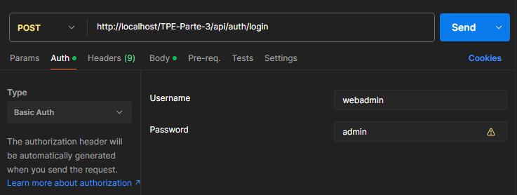
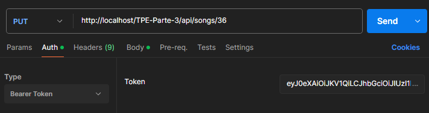

#  Trabajo Práctico Especial Web 2 | API Rest

### Grupo 80
Manzalini Abitante, Malena
> manzamale@gmail.com

***
Esta API nos permite listar, obtener, crear y editar canciones de artistas preexistentes.</br>

### [Documentación en Postman <<<](https://documenter.getpostman.com/view/30845267/2sB3WttenB) 
Además de la documentación presente en el README, intenté documentar en una colección de Postman, **esto se puede ignorar** (es más que nada para familiarizarme con Postman para TecDocVal)

> [!NOTE]
> Tener en cuenta que los IDs de canciones y artistas no estan "completos", osea que puede pasar que un numero (como el 1 o el 2) **no corresponda a ningun artista**, muchos fueron borrados o editados. El id de artista con id **4** es el que tiene la mayor cantidad de canciones, yo utilicé ese y el 6 principalmente para probar las funcionalidades.

## ENDPOINTS
| URL                       | VERBO         | CONTROLLER        | METODO        |  
| -----------               | ----------    | ------------      |------------   |
| `api/songs`               | GET           | ApiSongController | getSongs()    |
| `api/songs/:id`           | GET           | ApiSongController | getSong($id)  |
| `api/auth/login`          | POST          | ApiAuthController | login()       |
| `api/songs/`              | POST          | ApiSongController | addSong()     |
| `api/songs/:id`           | PUT           | ApiSongController | editSong($id) |

### 🎶 GET /api/songs
Devuelve el listado de canciones, podemos ordenar, filtrar y paginar los resultados con query params.

**Ejemplo de request:** obtener las canciones del artista con id=1, ordenadas por titulo de manera ascendente + mostrando 5 resultados por pagina desde la primera página</br>
`GET /api/songs?artist=4&orderBy=title&sort=ASC&limit=5&page=1`</br>
Debería retornar un **JSON** con código **200**, o de no haber encontrado canciones un código **404.**

| Parámetro | Descripción                                                               | Ejemplo          |
| --------- | ------------------------------------------------------------------------- | ---------------- |
| `artist`  | Filtra por id del artista                                                 | `?artist=4`      |
| `orderBy` | Ordena por columna (`title`, `album`, `duration`, `genre`, `artist_name`) | `?orderBy=title` |
| `sort`    | Sentido del ordenamiento (`ASC` o `DESC`)                                 | `?sort=DESC`     |
| `limit`   | Cantidad de resultados por página                                         | `?limit=10`      |
| `page`    | Página actual (para paginación)                                           | `?page=2`        |

### 🎶 GET /api/songs/:id
Devuelve **una** canción dado su id, ejemplo `GET /api/songs/3`</br>
Debería devolver **200** en caso de OK, **400** si falta parámetro, **404** si no fue encontrada.

***

### 🎶 POST /api/auth/login
> [!IMPORTANT]
> Al realizar un `POST` o `PUT` de songs, tenemos que ingresar un `token`.</br>
> Este token es generado cuando realizamos el request `auth/login` ingresando usuario (**webadmin**) y contraseña (**admin**) a través de Basic Auth

Debería devolver un body con el token.

> [!IMPORTANT]
> Ya generado el `token`, seleccionamos `Bearer Token` en **Auth** para realizar altas o modificaciones en la tabla songs.


### 🎶 POST /api/songs/
**Crea** una nueva canción. Al ser un POST enviamos el request tiene body</br>

La duración se indica en minutos y dos decimales, por ejemplo 3.55</br>
duration, genre y video pueden ir null.
```
{
  "id_artist": 4,
  "title": "Hola",
  "album": "El disco de tu corazón",
  "duration": "3.11",
  "genre": "",
  "video": ""
}
```
Debería devolver **201** si se crea la canción, **400** si los datos están incompletos.</br>

### 🎶 PUT /api/songs/:id
Actualiza una canción existente. Al igual que POST, como hacemos PUT enviamos body<br>
Deberia devolver **200** en caso de OK, **400** si faltan datos, **404** si no se encontró la canción a editar, o **500** si hay un error al actualizar.